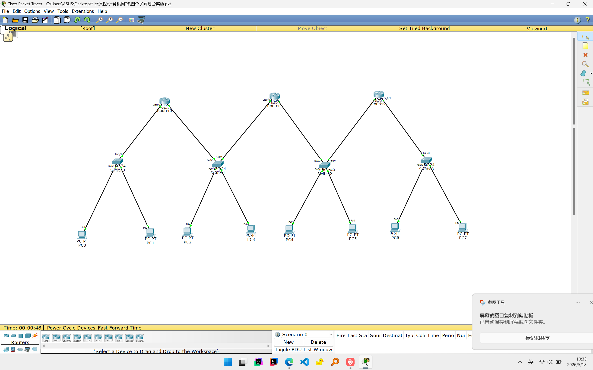
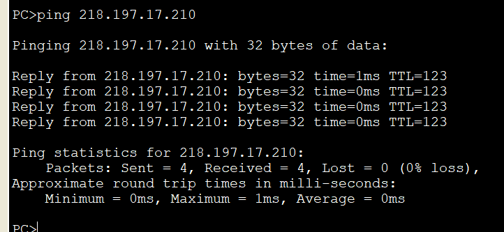

# 四个子网划分与路由配置实验

🚀 此实验参考于 [DeepJH/net-part-exp](https://github.com/DeepJH/net-part-exp) 

## 实验内容
题目要求：
- 某单位申请了一个IP为218.197.17.0，该单位需要建设四个网络，分别用于管理四个部门，要求分配各主机数量相同，试对该单位进行规划并配置。
实验要求：
- 构建4个子网(局域网)
- 用3个路由连接4个局域网
- 配置终端IP和路由器端口的网关
- 配置路由器，实现跨局域网通信
- 验证局域网、跨局域网的通信

## 地址规划
原始网络：
```
218.197.17.0/24
```
划分4个子网后的子网掩码为：
```
255.255.255.192
```
即
```
/26
```

| 部门 | 网络地址| 子网掩码 | 可用主机范围 | 广播地址 |
|---|---|---|---|---|
| 部门 1 | 218.197.17.0/26 | 255.255.255.192 | 218.197.17.1 - 218.197.17.62 | 218.197.17.63 |
| 部门 2 | 218.197.17.64/26 | 255.255.255.192 | 218.197.17.65 - 218.197.17.126 | 218.197.17.127 |
| 部门 3 | 218.197.17.128/26 | 255.255.255.192 | 218.197.17.129 - 218.197.17.190 | 218.197.17.191 |
| 部门 4 | 218.197.17.192/26 | 255.255.255.192 | 218.197.17.193 - 218.197.17.254 | 218.197.17.255 |

## 仓库结构

```
.
├── src
    └── 四个子网划分实验.pkt
├── img
│   ├── overview.png
│   └── pc1-ping.png
├── 四个子网划分与路由配置操作指南.md
├── LICENSE
└── README.md
```

## 文件说明
| 路径 | 说明 |
|---|---|
| [src/四个子网划分实验.pkt](src/四个子网划分实验.pkt) |  Cisco Packet Tracer 实验源文件 |
| [img/overview.png](img/overview.png) | 拓扑总览截图 |
| [img/pc1-ping.png](img/pc1-ping.png) | pc1跨网段ping测试 |

## 实验拓扑

实验使用：

- 3台`1941`路由器
- 4台`2950`交换机
- 8台PC
- 直通线`Copper Straight-Through`若干

拓扑总览：


## 如何开始实验

1.安装 Cisco Packet Tracer

2.对照 [实验操作指南](四个子网划分与路由配置操作指南.md) 查看地址规划、设备连接、路由器配置和测试步骤

## 验证结果
完成配置后，4 个部门之间可以互相通信。

示例：PC1 跨网段 ping 其他主机成功。



## 许可证

本仓库使用 MIT License，详见 [LICENSE](LICENSE)。
